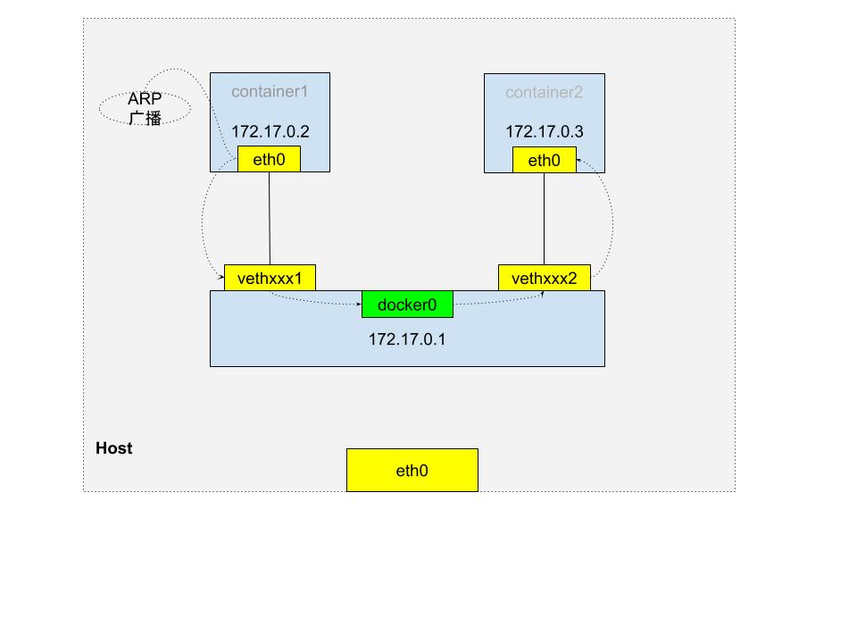

+++
title = "Container Network"
date =  2019-01-22T17:28:28+08:00
weight = 5
tag = ["container-network", "kubernetes", "k8s", "docker", "flannel", "cni"]
+++

## 同主机
**Veth Pair**

    

如上图，同主机容器，通过容器启动时创建的一对 Veth Pair 设备进行外部通信，Veth Pair 设备一端插在宿主机 `docker0`网桥上，一端是容器内的`eth0`网卡, 在宿主机上执行`brctl show docker0`可以查看连到`docker0`网桥上的设备。    
容器内默认的路由表：    
```shell
bash-4.3# route
Kernel IP routing table
Destination     Gateway         Genmask         Flags Metric Ref    Use Iface
default         172.17.0.1      0.0.0.0         UG    0      0        0 eth0
172.17.0.0      *               255.255.0.0     U     0      0        0 eth0
```
当同一主机上的容器 container1 需要和 container2 通信时，根据路由规则，container1 通过 eth0 网卡发往 container2 地址，两容器 IP 处于同一网段，container1 通过 ARP 协议获得 container2 MAC 地址，就可以将消息发送出去。    

## 跨主机
### Flannel
- UDP    
- VXLAN    
- host-gw    

#### UDP
UDP 模式的是性能最差的方式，目前已弃用。(因为在通信过程中要进行多次用户态到内核态的切换)    
    

如上图，flannel 会在每台宿主机上创建一系列的路由规则，一个 TUN 设备 flannel0(TUN 设备是一种工作在三层的虚拟网络设备，可以在内核和用户应用程序间传递IP包)，以及启动 flanneld 进程，监听 8285 端口。    
flannel 还会为 flannel 网络内的每台主机分配一个 subnet，容器会从所在宿主机的 subnet 中获取 IP。subnet 和 宿主机的对应关系保存在 etcd 中。    
当 node1 上的容器 container1 发送数据给同一 flannel 网络内节点 node2 上的容器 container2 时，因为两容器 IP 不在同一网段，首先会通过容器网关进入 docker0 网桥到达宿主机，然后又根据 flannel 创建的路由规则进入到 flannel0，并由 flannel0 转给 flanneld 进程， flannel 会根据目的容器 container2 的 IP 匹配到它对应的 subnet(100.96.2.0/24)，并从 etcd 中通过 subnet 获取到对应宿主机 node2 的 IP，这样，node1 上的 flanneld 进程就可以将数据发送给 node2上 的 flanneld 进程，进而将数据发送到目的容器。    
```shell
$ ip route
default via 10.168.0.1 dev eth0
# 非本机 subnet 下的 flannel 网络范围内的地址默认匹配到 flannel0
100.96.0.0/16 dev flannel0  proto kernel  scope link  src 100.96.1.0
# 本机 subnet 下的地址匹配到 docker0
100.96.1.0/24 dev docker0  proto kernel  scope link  src 100.96.1.1
10.168.0.0/24 dev eth0  proto kernel  scope link  src 10.168.0.2
```
**UDP模式下，docker0 网桥的地址范围必须是 flannel 为宿主机分配的子网。**     

#### VXLAN
VXLAN 模式封包解包都是在内核态中进行，所以和 UDP 模式相比性能较好。
    

vxlan 模式下，flannel 会在每台宿主机上创建路由规则，一个 VTEP(虚拟隧道端点) 设备 flannel.1。在通信过程中，封包解包操作直接由 VTEP 在内核态完成，而不用 flanneld 进行处理，这些 VTEP 间组成一个虚拟的二层网络，通过二层数据帧进行通信。    
当 node1 上的容器 container1 发送数据给同一 flannel 网络内节点 node2 上的容器 container2 时，同样先通过 docker0 到达宿主机 node1，然后会被转发到本机 VTEP 设备 flannel.1 进行处理；当一个节点加入 flannel 后，其他所有节点的 flanneld 进程都会在本地添加一条路由规则，即发往目的节点对应网段的数据包，都要经过 flannel.1 最终发往目的节点的 VTEP 设备的 IP 地址。根据这条规则，node1 的 flannel.1 设备收到数据包后，就要获 node2 的 VTEP 设备的 MAC 地址，将数据包封装成二层数据帧。为了可以获取 VTEP 的 MAC 地址，flanneld 进程会在新的节点加入后，在所有节点添加一条 ARP 记录，记录新节点 IP 对应的 MAC 地址，这样，Linux 内核就可以通过 ARP 记录直接获取到目的节点的 VTEP 设备的 MAC 地址并封装成数据帧(内部数据帧)，为了能够在宿主机网络传输，Linux 内核会再将此数据帧加上一个 VXLAN 头封装成外部数据帧。    
```shell
$ route -n
Kernel IP routing table
Destination     Gateway         Genmask         Flags Metric Ref    Use Iface
...
# flannel 当 node2 启动，其他所有节点会添加如下规则，即发往 10.1.16.0/24 网段的数据包，
# 都要经过 flannel.1, 且最终发往的网关地址为 10.1.16.0, 即 node2 上的 VTEP 设备 IP 地址。
10.1.16.0       10.1.16.0       255.255.255.0   UG    0      0        0 flannel.1
```

为了数据包能从 node1 的 flannel.1 设备发送到 node2 的flannel.1 设备上，还是需要借助宿主机网络从 node1 的 eth0 网卡发出到 node2 的 eth0 网卡。如何知道目的 VTEP 设备的宿主机地址呢? 此时 flannel.1 设备充当网桥的角色，在二层网络进行 UDP 包的转发。并由 flanneld 负责维护 falnnel.1 对应的 FDB 信息，通过 FDB 记录查询网桥转发的规则，这样就找到了 UDP 包要被发往的宿主机地址，接下来就可以通过正常的发包流程将数据发出去了。
```shell
# 在 Node 1 上，使用“目的 VTEP 设备”的 MAC 地址进行查询
$ bridge fdb show flannel.1 | grep 5e:f8:4f:00:e3:37
5e:f8:4f:00:e3:37 dev flannel.1 dst 10.168.0.3 self permanent

```


